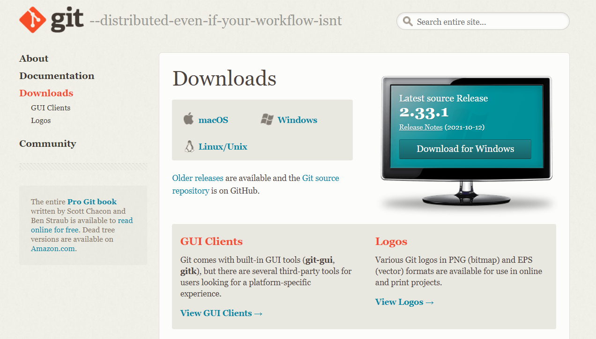
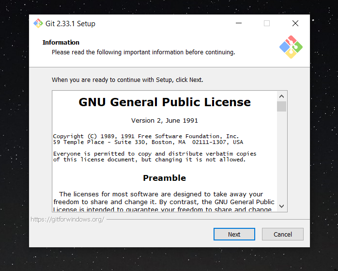
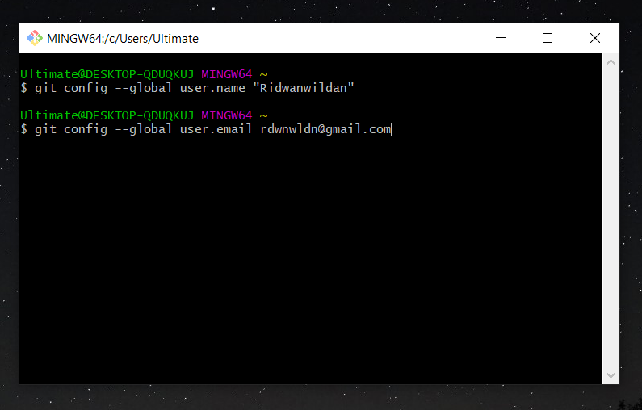
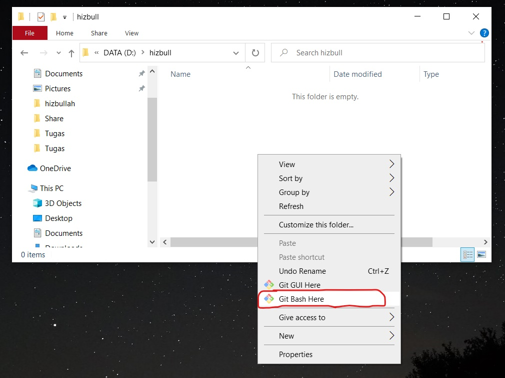
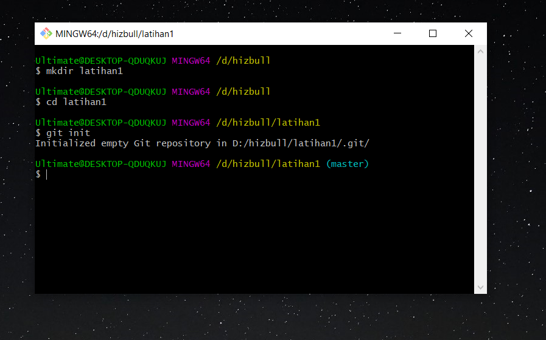
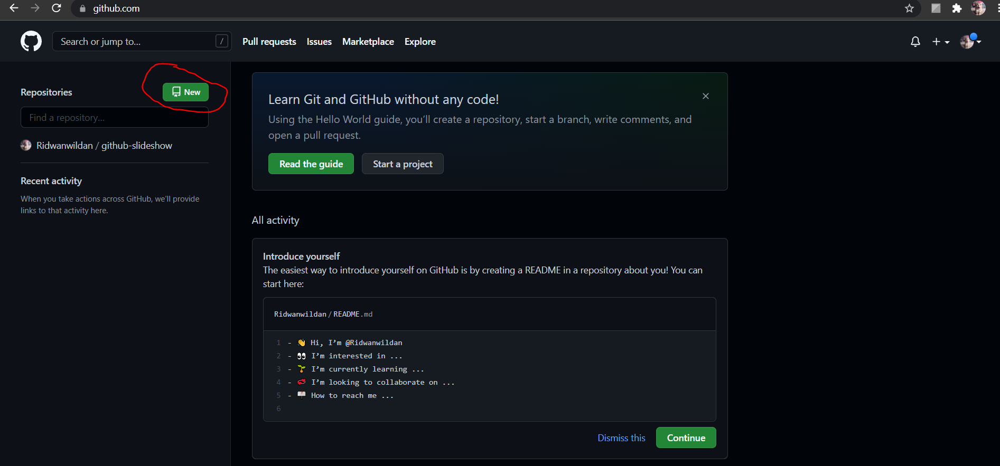
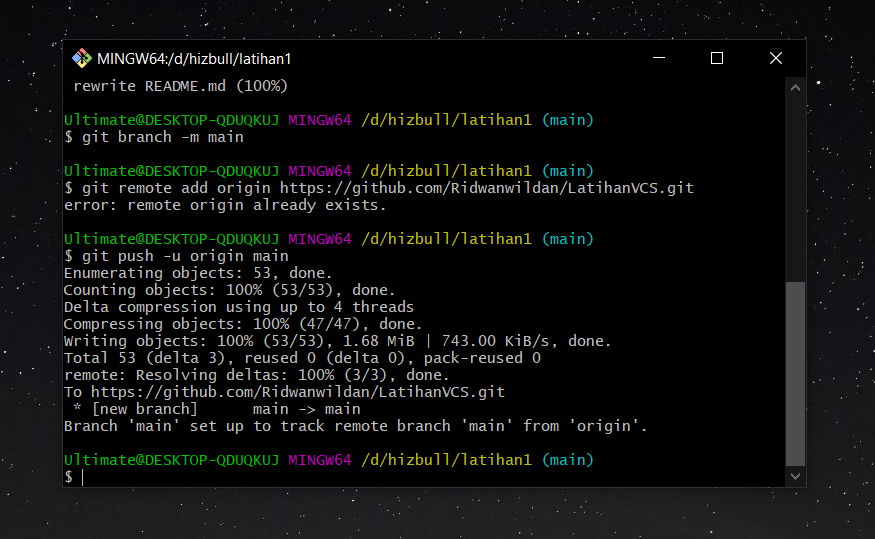

# Latihan Version Control System

Nama        : Hizbullah Ridwan
NIM         : 312110055
Kelas       : TI.21.C.1
Mata Kuliah : Bahasa Pemrograman

---------------------------------------------------------------------------

----> CARA MENGGUNAKAN GIT <----

1. Unduh Git
    Pertama, unduh git melalui website resminya yaitu https://git-scm.com/downloads
Pastikan git yang kita download sudah sesuai dengan arsitektur dan OS komputer kita.
setelah unduhan selesai, langsung klik next saja kemudian klik install supaya 
mudah dalam proses instalasi.

2. Install Git
    Setelah unduhan selesai, langsung klik next saja kemudian klik install supaya 
mudah dalam proses instalasi. Setelah proses install selesai, git bisa langsung kita buka.

3. Login Git
    Untuk login git kita bisa menggunakan akun dari Github. Kalau belum punya maka kita harus
Buat akun github terlebih dahulu melalui website https://github.com/signup
Jika sudah buat akun, kita kembali ke git dan ketik perintah seperti ini :

$ git config --global user.name "username"

isi "username" sesuai dengan username akun github yang kita miliki.
Kemudian tulis email kita dengan perintah seperti ini :

$ git config --global user.email emailkita@gmail.com

Untuk memastikan bahwa kita sudah login di git, kita bisa ketik seperti ini :

$ git config --list

4. Membuat Repository Local
    Jika kita menggunakan windows, buka file explorer kemudian buatlah sebuah folder baru.
Saya membuatnya di D:\hizbull . Di dalam folder ini, klik kanan kemudian pilih Git bash here.

Kemudian ketik perintah seperti ini :

$ mkdir latihan1
$ cd latihan1

ini akan menambahkan satu folder dibawahnya, maka jadinya D:\hizbull\latihan1 
dan ini adalah folder yang aktif sekarang. Kemudian ketik :

$ git init

sehingga folder tersebut berubah menjadi repository.

5. Menambahkan File Baru Di Repository
    Pertama, kita buat terlebih dahulu filenya, contoh membuatnya seperti ini :

$ echo "# Latihan 1" >> Readme.md

Kemudian tambahkan file yang baru saja kita buat dengan mengetik seperti ini :

$ git add Readme.md

6. Membuat Commit
    Commit berfungsi untuk menyimpan perubahan yang ada kedalam database repository local
Ketik seperti ini :

$ git commit -m "file yang pertama"

7. Membuat Repository Server
    Kita akan menggunakan Github sebagai repository server nya. setelah tadi kita buat akun github,
Cobalah sekarang untuk login ke akun kita. Di halaman utama klik New lalu beri nama repository yang
ingin kita buat, tentukan apakah repository tersebut mau kita jadikan public atau private.
Kita juga bisa menambahkan deskripsi dan file README.md didalamnya.

8. Menambahkan Remote Repository
    Remote Repository merupakan repository server yang akan digunakan untuk menyimpan setiap 
Perubahan pada local repository, sehingga dapat diakses oleh banyak user. Ketik seperti ini :

$ git remote add origin [url]

url nya sesuaikan dengan akun github milik kita. contohnya :
$ git remote add origin https://github.com/Ridwanwildan/LatihanVCS.git

catatan : tulisan error remote origin already exist, karena saya sudah menambahkan remote repository sebelumnya

9. Push ke Github
    Terakhir adalah coba untuk push ke github, fungsinya adalah untuk mengupload hasil akhir dari
Langkah-langkah yang tadi kita kerjakan. ketik seperti ini :

$ git push -u origin main

kalau pertama kali push, biasanya akan muncul popup yang mengharuskan kita untuk login ke akun github.

Sekian Terimakasih.

